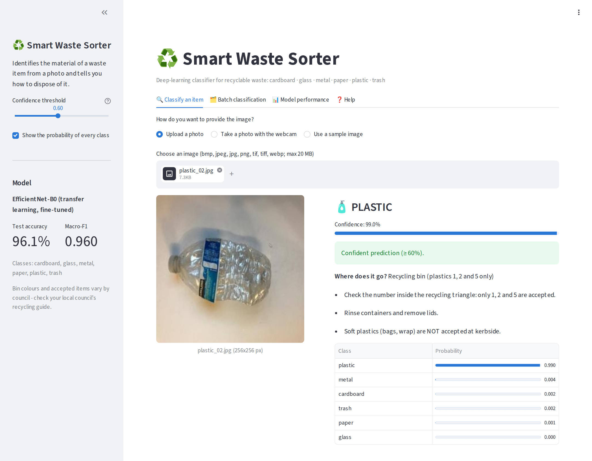

# ♻️ Smart Waste Sorter

**INFO813 Artificial Intelligence – Project (Trimester 3, 2026), Auckland Institute of Studies**

An intelligent system that recognises the material of a waste item from a photo (**cardboard, glass,
metal, paper, plastic or trash**) and tells the user how to dispose of it under New Zealand's standard
kerbside recycling rules. The model is an **EfficientNet-B0** convolutional neural network pre-trained on
ImageNet and fine-tuned on the Kaggle *Garbage Images Dataset (2000/class)*. It is embedded in an
interactive **Streamlit** web application written in Python.



## Results at a glance

| | |
|---|---|
| Test images (never used for training or model selection) | 1,675 |
| **Accuracy** | **96.1 %** (95 % CI 95.1 – 97.0 %) |
| **Macro-F1** | **0.960** (F1 per class 0.944 – 0.975) |
| Top-2 accuracy / macro ROC-AUC | 99.1 % / 0.996 |
| Calibration error (ECE) after temperature scaling | 0.083 → 0.008 |
| Accepted at the app's 60 % threshold | 98.1 % of images, 97.0 % of them correct |
| Best alternative models (same split) | frozen EfficientNet + logistic regression 90.4 %, SVM on HOG/colour/LBP 70.4 %, CNN from scratch 70.4 % |
| Model file / CPU speed | ONNX, 8.1 MB, ≈ 15 ms per image (Colab CPU) |

Key data findings: 32 % of the files form byte-identical pairs (mostly TrashNet photos included twice),
so copies were removed and near-duplicates kept in one subset (stratified *group* split) to avoid
leakage; the images come from at least three public collections (TrashNet, a 12-class Kaggle set and the
Garbage Dataset), and the *trash* class consists mainly of clothes, shoes, food waste and batteries.

---

## 1. Run the application (for the marker)

Requirements: **Python 3.10 – 3.13** and an internet connection the first time (to install the libraries).
No GPU and no PyTorch are needed – the app uses the exported ONNX model.

| Operating system | What to do |
|---|---|
| **Windows** | Double-click **`run_app.bat`** |
| **macOS / Linux** | In a terminal: `./run_app.sh` (or `bash run_app.sh`) |

The launcher creates a virtual environment in `.venv`, installs `requirements.txt` (first run only,
1–3 minutes) and opens the app at **http://localhost:8501**.

Manual alternative (any OS), from this folder:

```bash
python -m venv .venv
# Windows: .venv\Scripts\activate      macOS/Linux: source .venv/bin/activate
pip install -r requirements.txt
streamlit run app/streamlit_app.py      # then open the "Local URL" shown in the terminal
```

Command-line version (no browser needed): `python app/cli.py` (interactive menu) or
`python app/cli.py sample_images --csv results.csv`.

The full user guide is in section 3.2 of the report and in [`docs/USER_GUIDE.md`](docs/USER_GUIDE.md).

## 2. Repository structure

```
smart-waste-sorter/
├── app/                      # interactive software (Part 3)
│   ├── streamlit_app.py      #   web interface (upload / webcam / sample / batch / folder)
│   ├── cli.py                #   command-line interface
│   ├── predictor.py          #   ONNX inference + pre-processing identical to training
│   ├── validation.py         #   validation of every input file
│   └── recycling_guide.py    #   disposal advice per class (NZ kerbside standard)
├── model/                    # trained model used by the app
│   ├── waste_classifier.onnx #   EfficientNet-B0, float16 weights (~8 MB)
│   ├── model_info.json       #   classes, normalisation, temperature, test metrics
│   └── confusion_matrix.png  #   shown in the app's "Model performance" tab
├── sample_images/            # test-set images for a quick demo (incl. two hard cases)
├── src/waste_classifier/     # analysis + modelling package (Parts 1 and 2)
├── notebooks/                # Smart_Waste_Sorter_Colab.ipynb - end-to-end pipeline (GPU)
├── scripts/                  # run_pipeline.py, build_colab_notebook.py, regenerate_figures.py,
│                             # capture_app_screenshots.py, package_submission.py, ...
├── reports/
│   ├── report_builder/       # builds the Word report from the pipeline results (docx-js)
│   ├── slides_builder/       # builds the PowerPoint presentation (pptxgenjs)
│   └── figures/              # pipeline diagram and application screenshots
├── tests/                    # pytest unit tests (validation, predictor, pre-processing parity)
├── data/README.md            # how to obtain the dataset + train/val/test split manifest
├── requirements.txt          # app libraries
├── requirements-train.txt    # extra libraries for analysis/training
└── run_app.bat / run_app.sh  # one-click launchers
```

## 3. Reproduce the analysis and the model

* **Google Colab (recommended, GPU):** open `notebooks/Smart_Waste_Sorter_Colab.ipynb`, choose
  *Runtime → Change runtime type → T4 GPU* and *Run all* (~45–60 min including the provenance check and
  the baselines). The notebook reads the Kaggle `archive.zip` from Google Drive (or downloads it with
  `kagglehub`) and produces all figures, metrics, the ONNX model and `results.zip`. If Colab runs out of
  memory after training, the last cell of the notebook finishes the run from the saved model.
* **Local computer:** `pip install -r requirements-train.txt` then
  `python scripts/run_pipeline.py --zip path/to/archive.zip --out outputs`.
* **Report and slides** (from an extracted `results.zip`):
  ```bash
  python scripts/regenerate_figures.py results            # redraw CSV-based figures
  python reports/report_builder/prepare_report_data.py results report_data.json
  cd reports/report_builder && npm install && node build.js ../../report_data.json report.docx
  ```

## 4. Data

*Garbage Images Dataset (2000/class)*, version 5, by Leonardo Cofone (Kaggle user `zlatan599`), MIT licence:
<https://www.kaggle.com/datasets/zlatan599/garbage-dataset-classification>. See [`data/README.md`](data/README.md).

## 5. Tests

```bash
pip install pytest onnx torch torchvision   # torch/torchvision only for the pre-processing parity test
python -m pytest -q tests
```

## 6. Libraries

Application: streamlit, onnxruntime, numpy, pillow, pandas.
Analysis & training: PyTorch, torchvision, timm, scikit-learn, scikit-image, OpenCV, matplotlib,
imagehash, onnx, kagglehub.

## 7. Use of AI tools

Claude (Anthropic) was used as a programming and writing assistant; see Appendix C of the report.
